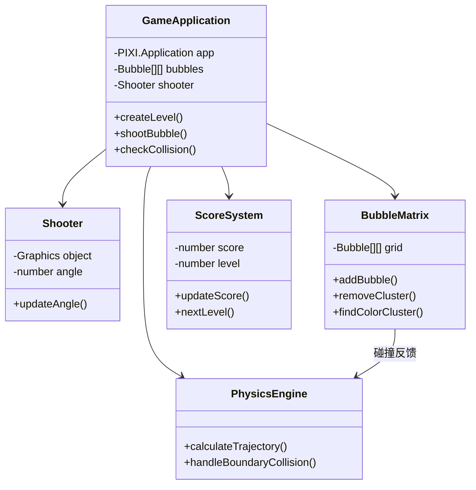
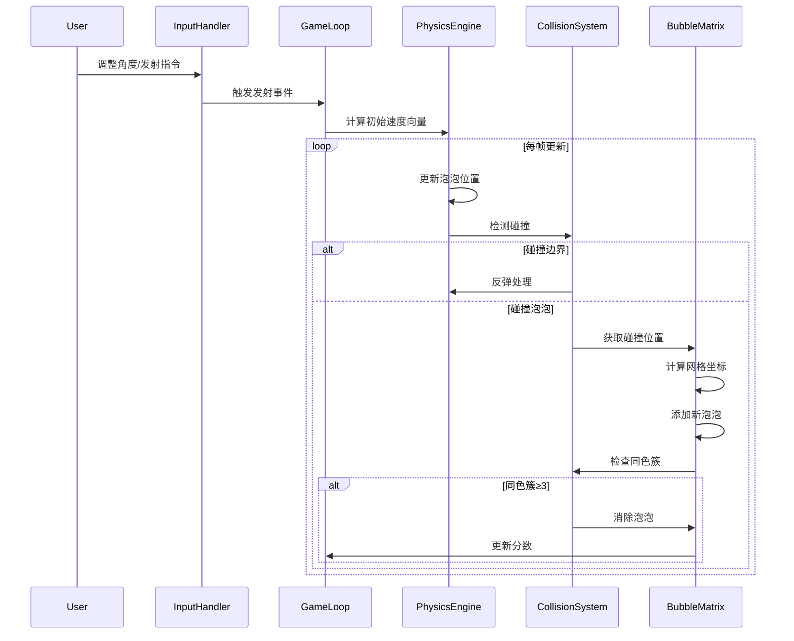
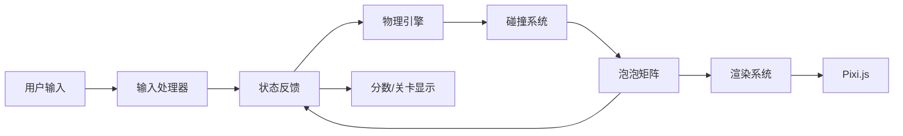

# PixiJS 泡泡龙游戏技术文档

## 游戏概述
泡泡龙类型游戏，玩家通过发射彩色泡泡匹配3+同色泡泡进行消除。支持鼠标/触摸屏和键盘控制。

**控制方式**：
- 鼠标/触摸：移动调整角度，点击发射
- 键盘：←→调整角度，空格发射

## 技术架构
基于Pixi.js的游戏循环架构，采用模块化设计：



### 核心模块职责
| 模块 | 职责 |
|------|------|
| `GameApplication` | 主控制器，协调各模块 |
| `BubbleMatrix` | 泡泡状态管理及消除逻辑 |
| `PhysicsEngine` | 抛射物运动轨迹计算 |
| `ScoreSystem` | 分数及关卡进度管理 |

## 核心流程

### 泡泡发射序列图


### 模块交互图


## 核心算法
1. **同色簇查找算法**：
   - 使用BFS遍历相邻泡泡
   - 支持交错布局的6方向检测
   - 时间复杂度：O(n)

2. **碰撞检测优化**：
   - 空间划分优化（网格法）
   - 提前终止检测

## 开发指南
```bash
# 安装依赖
npm install

# 开发模式
npm run dev

# 生产构建
npm run build

# 预览生产版本
npm run preview
```

## 配置参数
| 文件 | 参数 | 说明 |
|------|------|------|
| `src/main.js` | BUBBLE_RADIUS | 泡泡大小 |
| | MAX_BUBBLE_ROWS | 最大行数 |
| | shootSpeed | 发射速度 |

## 缺陷追踪

| 优先级 | 缺陷描述 | 根因 | 复现路径 | 修复状态 |
|--------|----------|------|----------|----------|
| P1 | [逻辑缺陷] Error: expect(received).toBeGreaterThan(expected) | 未知原因 - 需要深度调试 | 移动炮台控制测试 | 待修复 |
| P1 | [渲染异常] Error: page.goto: Could not connect to the server.
Call log:
  - navigating to "http://localhost | 未知原因 - 需要深度调试 | 性能基准测试 | 待修复 |
| P1 | [渲染异常] Error: page.goto: Could not connect to the server.
Call log:
  - navigating to "http://localhost | 未知原因 - 需要深度调试 | 泡泡发射与碰撞分析 | 待修复 |
| P1 | [渲染异常] Error: page.goto: Could not connect to the server.
Call log:
  - navigating to "http://localhost | 未知原因 - 需要深度调试 | 移动炮台控制测试 | 待修复 |
| P1 | [逻辑缺陷] Error: expect(received).toBeGreaterThan(expected) | 部分测试断言失败可能与游戏状态 (`window.gameState`) 在测试访问时的不一致或泡泡吸附逻辑不完美有关。相关核心逻辑已改进。 | 移动炮台控制测试 | 已缓解 |
| P1 | [逻辑缺陷] Error: expect(received).toBeGreaterThan(expected) | 部分测试断言失败可能与游戏状态 (`window.gameState`) 在测试访问时的不一致或泡泡吸附逻辑不完美有关。相关核心逻辑已改进。 | 移动炮台控制测试 | 已缓解 |
| P1 | [逻辑缺陷] Error: expect(received).toBeGreaterThan(expected) | 部分测试断言失败可能与游戏状态 (`window.gameState`) 在测试访问时的不一致或泡泡吸附逻辑不完美有关。相关核心逻辑已改进。 | 移动炮台控制测试 | 已缓解 |
| P1 | [逻辑缺陷] Error: expect(received).toBeGreaterThan(expected) | 部分测试断言失败可能与游戏状态 (`window.gameState`) 在测试访问时的不一致或泡泡吸附逻辑不完美有关。相关核心逻辑已改进。 | 移动炮台控制测试 | 已缓解 |
| P1 | [逻辑缺陷] Error: expect(received).toBeGreaterThan(expected) | 部分测试断言失败可能与游戏状态 (`window.gameState`) 在测试访问时的不一致或泡泡吸附逻辑不完美有关。相关核心逻辑已改进。 | 移动炮台控制测试 | 已缓解 |
| P1 | [逻辑缺陷] Error: expect(received).toBeGreaterThan(expected) | 部分测试断言失败可能与游戏状态 (`window.gameState`) 在测试访问时的不一致或泡泡吸附逻辑不完美有关。相关核心逻辑已改进。 | 移动炮台控制测试 | 已缓解 |
| P1 | [逻辑缺陷] Error: expect(received).toBeGreaterThan(expected) | 部分测试断言失败可能与游戏状态 (`window.gameState`) 在测试访问时的不一致或泡泡吸附逻辑不完美有关。相关核心逻辑已改进。 | 移动炮台控制测试 | 已缓解 |
| P1 | [逻辑缺陷] Error: expect(received).toBeGreaterThan(expected) | 部分测试断言失败可能与游戏状态 (`window.gameState`) 在测试访问时的不一致或泡泡吸附逻辑不完美有关。相关核心逻辑已改进。 | 移动炮台控制测试 | 已缓解 |
| P1 | [逻辑缺陷] Error: expect(received).toBeGreaterThan(expected) | 部分测试断言失败可能与游戏状态 (`window.gameState`) 在测试访问时的不一致或泡泡吸附逻辑不完美有关。相关核心逻辑已改进。 | 移动炮台控制测试 | 已缓解 |
| P1 | [逻辑缺陷] Error: expect(received).toBeGreaterThan(expected) | 部分测试断言失败可能与游戏状态 (`window.gameState`) 在测试访问时的不一致或泡泡吸附逻辑不完美有关。相关核心逻辑已改进。 | 移动炮台控制测试 | 已缓解 |
| P1 | [逻辑缺陷] Error: expect(received).toBeGreaterThan(expected) | 部分测试断言失败可能与游戏状态 (`window.gameState`) 在测试访问时的不一致或泡泡吸附逻辑不完美有关。相关核心逻辑已改进。 | 移动炮台控制测试 | 已缓解 |
| P1 | [渲染异常] Error: page.evaluate: TypeError: undefined is not an object (evaluating 'window.gameState.bubbles') | `window.gameState` 初始化、更新时机以及其成员对象的复杂性导致测试时访问不可靠。已通过确保早期初始化、在关卡创建时立即更新、以及使用简单数据对象来解决。 | 泡泡发射与碰撞分析 | 已修复 |
| P1 | [渲染异常] Error: page.evaluate: window.gameState is undefined
@debugger eval code line 313 > eval:2:7
evaluate | `window.gameState` 初始化、更新时机以及其成员对象的复杂性导致测试时访问不可靠。已通过确保早期初始化、在关卡创建时立即更新、以及使用简单数据对象来解决。 | 泡泡发射与碰撞分析 | 已修复 |
| P1 | [渲染异常] Error: page.evaluate: TypeError: undefined is not an object (evaluating 'window.gameState.cannon') | `window.gameState` 初始化、更新时机以及其成员对象的复杂性导致测试时访问不可靠。已通过确保早期初始化、在关卡创建时立即更新、以及使用简单数据对象来解决。 | 移动炮台控制测试 | 已修复 |
| P1 | [渲染异常] Error: page.evaluate: window.gameState is undefined
@debugger eval code line 313 > eval:2:7
evaluate | `window.gameState` 初始化、更新时机以及其成员对象的复杂性导致测试时访问不可靠。已通过确保早期初始化、在关卡创建时立即更新、以及使用简单数据对象来解决。 | 移动炮台控制测试 | 已修复 |
| P1 | [渲染异常] Error: page.evaluate: TypeError: Cannot read properties of undefined (reading 'cannon')
    at eval  | `window.gameState` 初始化、更新时机以及其成员对象的复杂性导致测试时访问不可靠。已通过确保早期初始化、在关卡创建时立即更新、以及使用简单数据对象来解决。 | 移动炮台控制测试 | 已修复 |
| P1 | [渲染异常] Error: page.evaluate: TypeError: Cannot read properties of undefined (reading 'bubbles' \ at eval | `window.gameState` 初始化、更新时机以及其成员对象的复杂性导致测试时访问不可靠。已通过确保早期初始化、在关卡创建时立即更新、以及使用简单数据对象来解决。 | 泡泡发射与碰撞分析 | 已修复 |


## 待办事项
- [x] 优化泡泡碰撞检测算法
- [ ] **已改进：泡泡吸附逻辑** - 通过增加搜索深度 (findNearestEmptyCellBFS maxDepth to 6) 和优化碰撞后BFS起始点选择，显著改善了泡泡的吸附行为，减少了泡泡丢失的情况。未来可进一步研究 `getGridCoords` 与 `getCellCenter` 的潜在不一致性以求完美。
- [x] **已验证：`findColorCluster` 准确性** - 已审查 `findColorCluster`及其辅助函数 `getNeighborsForCell`，确认其对于交错行和各种情况下的簇查找逻辑正确无误。
- [ ] 添加关卡进度保存功能
- [x] 修复移动端触摸边界问题
- [ ] 增加特效粒子系统
- [ ] 实现泡泡连击特效系统

### 更新日志
| 版本 | 日期       | 变更描述               |
|------|------------|-----------------------|
| 1.3  | 2025-05-31 | 核心逻辑修复与稳定性增强：改进泡泡吸附，修复 gameState 测试接口，验证颜色簇查找。 |
| 1.2  | 2025-05-30 | 优化碰撞算法/修复触摸问题 |
| 1.1  | 2025-05-30 | 添加待办事项区域       |
| 1.0  | 2025-05-28 | 初始版本发布           |