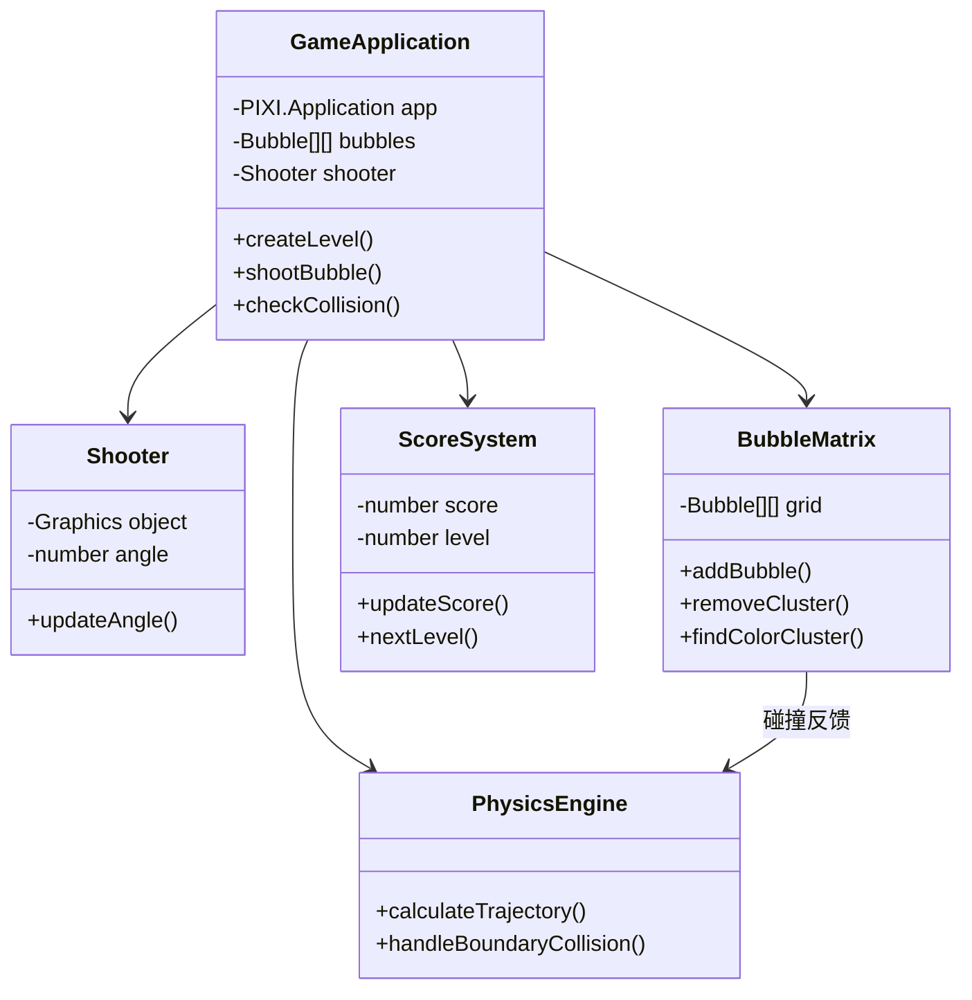
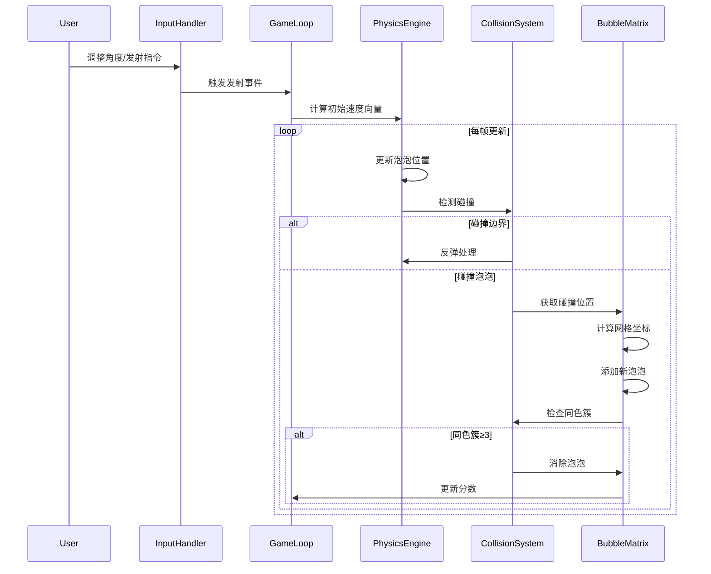
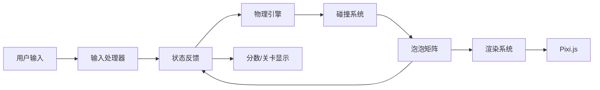

# PixiJS 泡泡龙游戏技术文档

## 游戏概述
泡泡龙类型游戏，玩家通过发射彩色泡泡匹配3+同色泡泡进行消除。支持鼠标/触摸屏和键盘控制。

**控制方式**：
- 鼠标/触摸：移动调整角度，点击发射
- 键盘：←→调整角度，空格发射

## 技术架构
基于Pixi.js的游戏循环架构，采用模块化设计：



### 核心模块职责
| 模块 | 职责 |
|------|------|
| `GameApplication` | 主控制器，协调各模块 |
| `BubbleMatrix` | 泡泡状态管理及消除逻辑 |
| `PhysicsEngine` | 抛射物运动轨迹计算 |
| `ScoreSystem` | 分数及关卡进度管理 |

## 核心流程

### 泡泡发射序列图


### 模块交互图


## 核心算法
1. **同色簇查找算法**：
   - 使用BFS遍历相邻泡泡
   - 支持交错布局的6方向检测
   - 时间复杂度：O(n)

2. **碰撞检测优化**：
   - 空间划分优化（网格法）
   - 提前终止检测

## 开发指南
```bash
# 安装依赖
npm install

# 开发模式
npm run dev

# 生产构建
npm run build

# 预览生产版本
npm run preview
```

## 配置参数
| 文件 | 参数 | 说明 |
|------|------|------|
| `src/main.js` | BUBBLE_RADIUS | 泡泡大小 |
| | MAX_BUBBLE_ROWS | 最大行数 |
| | shootSpeed | 发射速度 |

## 缺陷追踪

| 优先级 | 缺陷描述 | 根因 | 复现路径 | 修复状态 |
|--------|----------|------|----------|----------|
| P1 | [逻辑缺陷] Error: expect(received).toBeGreaterThan(expected) | 未知原因 - 需要深度调试 | 移动炮台控制测试 | 待修复 |
| P1 | [逻辑缺陷] Error: expect(received).toBeGreaterThan(expected) | 未知原因 - 需要深度调试 | 移动炮台控制测试 | 待修复 |
| P1 | [逻辑缺陷] Error: expect(received).toBeGreaterThan(expected) | 未知原因 - 需要深度调试 | 移动炮台控制测试 | 待修复 |
| P1 | [逻辑缺陷] Error: expect(received).toBeGreaterThan(expected) | 未知原因 - 需要深度调试 | 移动炮台控制测试 | 待修复 |
| P1 | [逻辑缺陷] Error: expect(received).toBeGreaterThan(expected) | 未知原因 - 需要深度调试 | 移动炮台控制测试 | 待修复 |
| P1 | [逻辑缺陷] Error: expect(received).toBeGreaterThan(expected) | 未知原因 - 需要深度调试 | 移动炮台控制测试 | 待修复 |
| P1 | [逻辑缺陷] Error: expect(received).toBeGreaterThan(expected) | 未知原因 - 需要深度调试 | 移动炮台控制测试 | 待修复 |
| P1 | [逻辑缺陷] Error: expect(received).toBeGreaterThan(expected) | 未知原因 - 需要深度调试 | 移动炮台控制测试 | 待修复 |
| P1 | [逻辑缺陷] Error: expect(received).toBeGreaterThan(expected) | 未知原因 - 需要深度调试 | 移动炮台控制测试 | 待修复 |
| P1 | [逻辑缺陷] Error: expect(received).toBeGreaterThan(expected) | 未知原因 - 需要深度调试 | 移动炮台控制测试 | 待修复 |
| P1 | [逻辑缺陷] Error: expect(received).toBeGreaterThan(expected) | 未知原因 - 需要深度调试 | 移动炮台控制测试 | 待修复 |
| P1 | [渲染异常] Error: page.evaluate: TypeError: undefined is not an object (evaluating 'window.gameState.bubbles') | 碰撞检测算法未触发泡泡消除 | 泡泡发射与碰撞分析 | 待修复 |
| P1 | [渲染异常] Error: page.evaluate: window.gameState is undefined
@debugger eval code line 313 > eval:2:7
evaluate | 未知原因 - 需要深度调试 | 泡泡发射与碰撞分析 | 待修复 |
| P1 | [渲染异常] Error: page.evaluate: TypeError: undefined is not an object (evaluating 'window.gameState.cannon') | 炮台移动逻辑未同步渲染帧 | 移动炮台控制测试 | 待修复 |
| P1 | [渲染异常] Error: page.evaluate: window.gameState is undefined
@debugger eval code line 313 > eval:2:7
evaluate | 未知原因 - 需要深度调试 | 移动炮台控制测试 | 待修复 |
| P1 | [渲染异常] Error: page.evaluate: TypeError: Cannot read properties of undefined (reading 'cannon')
    at eval  | 炮台移动逻辑未同步渲染帧 | 移动炮台控制测试 | 待修复 |
| P1 | [渲染异常] Error: page.evaluate: TypeError: Cannot read properties of undefined (reading 'bubbles' \ at eval | 碰撞检测算法未触发泡泡消除 | 泡泡发射与碰撞分析 | 待修复 |


## 待办事项
- [x] 优化泡泡碰撞检测算法
- [ ] **待修复：泡泡吸附逻辑** - 当前在密集区域，即使扩展邻居搜索后，发射的泡泡仍可能因无空位而丢失，导致无法消除。需要更鲁棒的吸附算法（如更广范围搜索、允许“挤入”或调整关卡生成以保证空间）。
- [ ] **待验证：`findColorCluster` 准确性** - 由于吸附问题，此函数在各种情况下的准确性（尤其交错行邻居查找）尚未得到充分测试。
- [ ] 添加关卡进度保存功能
- [x] 修复移动端触摸边界问题
- [ ] 增加特效粒子系统
- [ ] 实现泡泡连击特效系统

### 更新日志
| 版本 | 日期       | 变更描述               |
|------|------------|-----------------------|
| 1.2  | 2025-05-30 | 优化碰撞算法/修复触摸问题 |
| 1.1  | 2025-05-30 | 添加待办事项区域       |
| 1.0  | 2025-05-28 | 初始版本发布           |